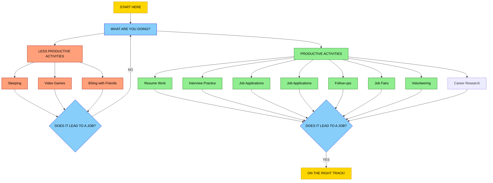

```mermaid
flowchart TB
    %% Set larger font size
    classDef default fontSize:14pt;
    
    %% Define color classes
    classDef startEnd fill:#FFD700,stroke:#B8860B,color:black
    classDef question fill:#87CEFA,stroke:#0000CD,color:black
    classDef productive fill:#90EE90,stroke:#006400,color:black
    classDef unproductive fill:#FFA07A,stroke:#8B0000,color:black
    classDef yes fill:#00FF00,stroke:#006400,color:black,bold
    classDef no fill:#FF6347,stroke:#8B0000,color:black,bold
    
    Start["START HERE"] --> Activities
    Activities["WHAT ARE YOU DOING?"] --> Unproductive
    Activities --> Productive
    
    Unproductive["LESS PRODUCTIVE ACTIVITIES"]
    Unproductive --> U1["Sleeping"]
    Unproductive --> U2["Video Games"]
    Unproductive --> U3["BSing with Friends"]
    
    U1 & U2 & U3 --> UnproductiveQuestion
    
    UnproductiveQuestion{"DOES IT LEAD TO A JOB?"}
    UnproductiveQuestion -->|"NO"| Activities
    
    Productive["PRODUCTIVE ACTIVITIES"]
    Productive --> P1["Resume Work"]
    Productive --> P2["Interview Practice"]
    Productive --> P3["Job Applications"]
    Productive --> P4["Job Applications"]
    Productive --> P5["Follow-ups"]
    Productive --> P6["Job Fairs"]
    Productive --> P7["Volunteering"]
    Productive --> P8["Career Research"]
    
    P1 & P2 & P3 & P4 & P5 & P6 & P7 & P8 --> ProductiveQuestion
    
    ProductiveQuestion{"DOES IT LEAD TO A JOB?"}
    ProductiveQuestion -->|"YES"| Success["ON THE RIGHT TRACK!"]
    
    %% Apply color classes
    class Start,Success startEnd
    class Activities,UnproductiveQuestion,ProductiveQuestion question
    class Productive,P1,P2,P3,P4,P5,P6,P7 productive
    class Unproductive,U1,U2,U3 unproductive
```
